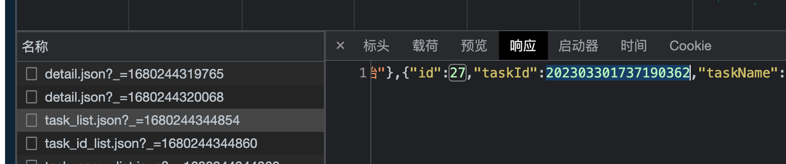
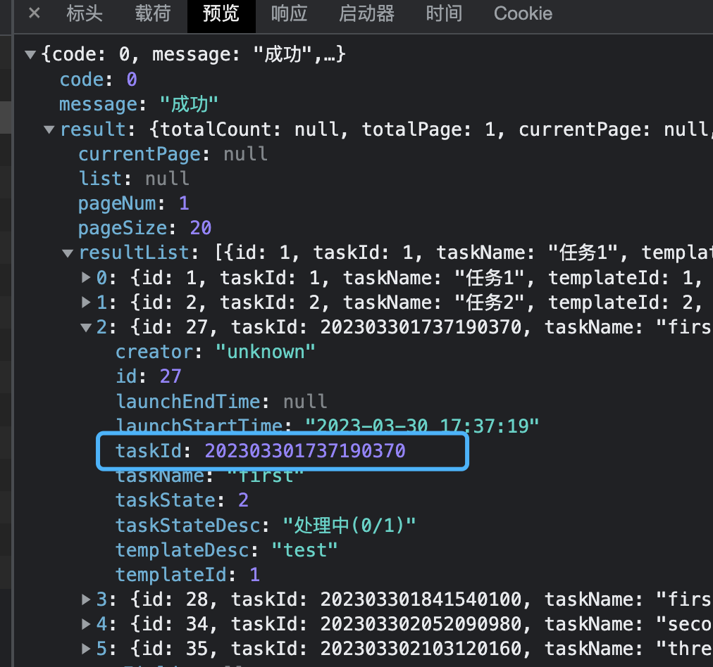

## 精度丢失原因

### JavaScript 中 Number 特性

JavaScript 中数字类型只有 Number 类型，不区分 int、long、double 等。根据（[IEEE 754 标准](https://segmentfault.com/a/1190000008268668)）来表示实现它的 Number 类型。

### 最大安全整数

根据 IEEE 754 标准，其 16 进制形式为 0x001f_ffff_ffff_ffff ，即 9007199254740991。它等于 2 的 53 次方减 1，在 ES6 中，Number.MAX_SAFE_INTEGER 即为最大安全整数。

如果超过最大安全整数，则不能用数值传递，需要用其他数据类型，比如字符串，或拆分成两个数据字段。否则会出现精度丢失。

```javascript
Number.MAX_SAFE_INTEGER === Math.pow(2, 53) - 1; // true
Number.MAX_SAFE_INTEGER === 0x001f_ffff_ffff_ffff; // true
Number.MAX_SAFE_INTEGER === 9007199254740991; // true
Number.MAX_SAFE_INTEGER === -Number.MIN_SAFE_INTEGER; // true
```

## 前端解决方案


response 看到的其实是 JSON 字符串格式，也就是原始数据，是没问题的


而在 preview 中看到的其实是已经被 JSON.parse 后的数据，axios 默认会对 response 的数据进行 JSON.parse 处理成 JSON 对象。所以就可能出现精度丢失的问题。

所以解决的思路就是在**response 数据传递前进行修改或转换**。

### 第三方包转换

> json-bigint 会在把 json 字符串转 json 对象的过程中，自动识别大整数，把超出 JS 安全整数范围的数字转成一个类型为 BigNumber 的对象来表示，并以数组的格式保存，规避了精度丢失的问题。

```javascript
import JSONbig from "json-bigint";

const str = '{ "id": 1253585734669959168 }';

console.log(JSON.parse(str).id); // 1253585734669959200

console.log(JSONbig.parse(str).id); // BigNumber {s: 1, e: 18, c: [12535, 85734669959168]}

//  BigNumber.toString() 就能得到原来正确的数据了
console.log(JSONbig.parse(str).id.toString()); // 1253585734669959168
```

### 使用

在 axios 提供的 transformResponse 方法中对数据进行统一处理

```javascript/导入
import JSONbig from 'json-bigint'

//这个方法的作用是在传递给then/catch前，允许修改响应数据

//axios在这里默认把响应体从json字符串转成了js对象
axios.defaults.transformResponse = [function (data) {
     try {
          return JSONbig.parse(data)
     }catch(){
         return data;
     }
 }]
//如果不写这个方法，返回的数据是自动就转为json对象的了，如果写了，就要自己转为对象，即return JSON.parse(data)
```
