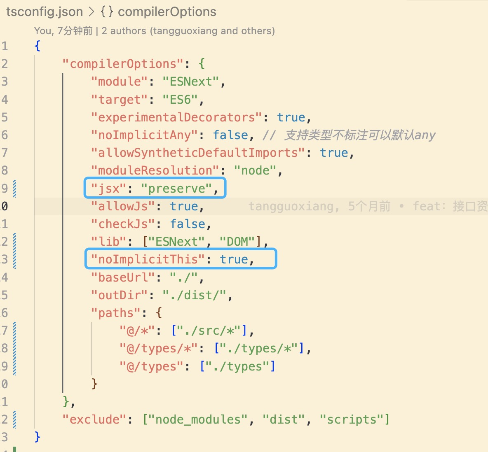
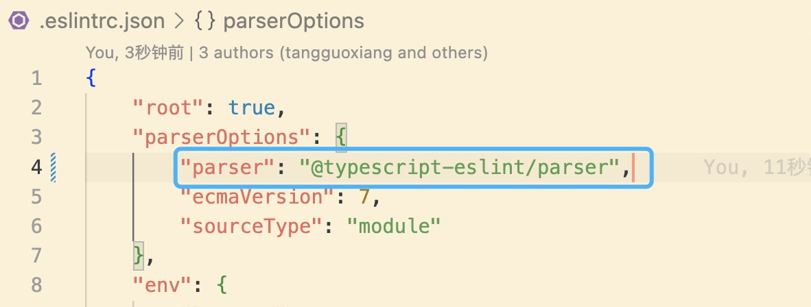
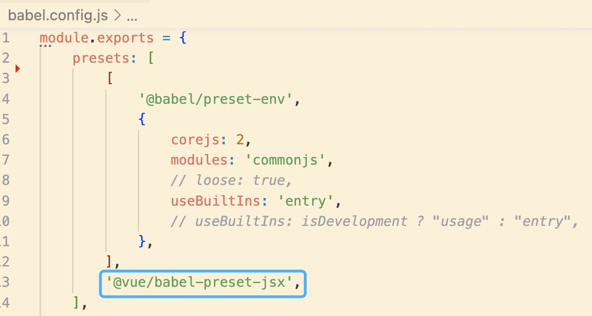
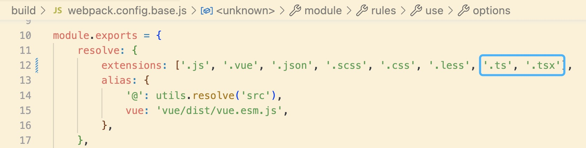
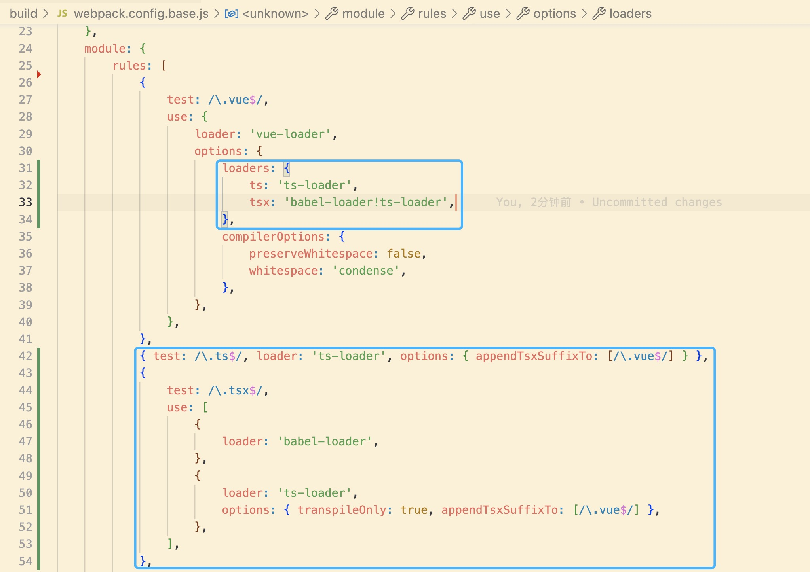
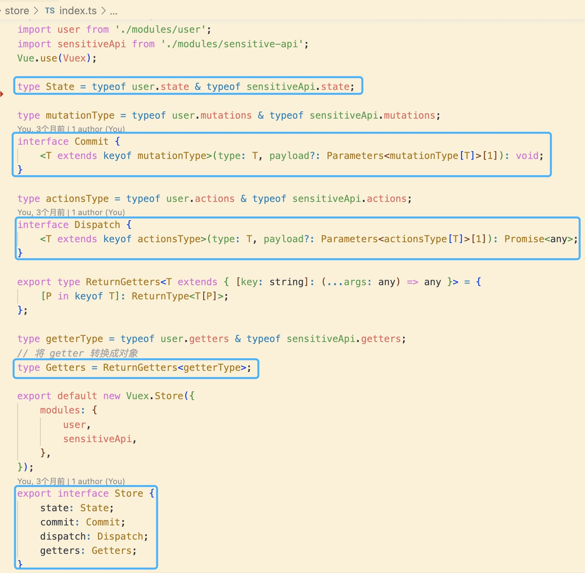
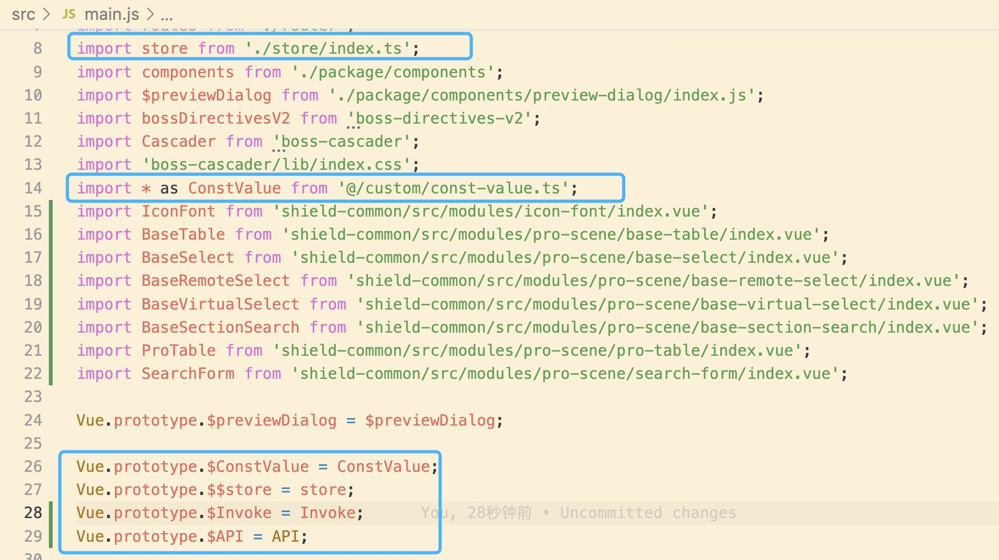
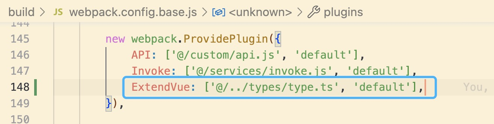
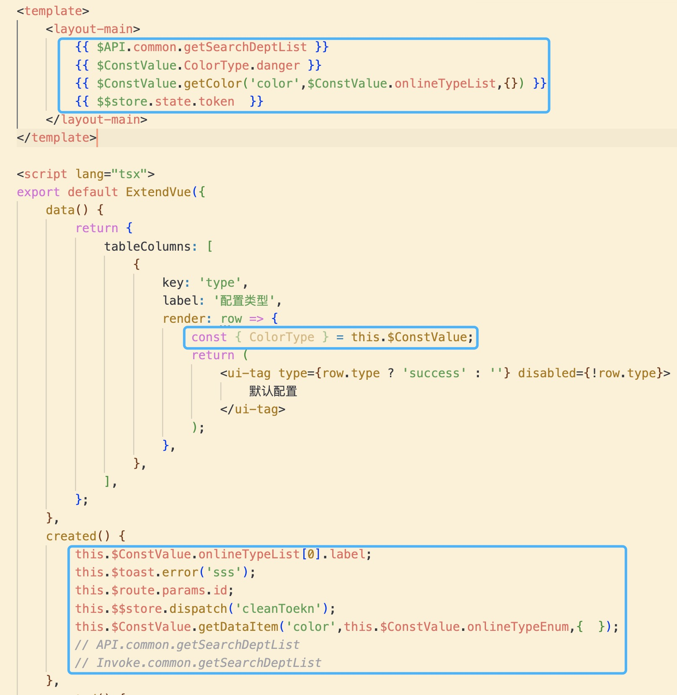

升级参考分支 **fe-shield-zeph: chore/ts-upgrade**

## 升级为 ts 项目及支持 jsx

### 安装依赖

```js
yarn add typescript ts-loader @vue/eslint-config-typescript -D // 安装ts相关依赖

yarn add @vue/babel-preset-jsx  -D // 支持jsx语法

```

### 配置

tsconfig.json

```js
"jsx": "preserve",
"noImplicitThis": true,
```



.eslintrc.json

```js
"parser": "@typescript-eslint/parser"
```



babel.config.js

```js
"@vue/babel-preset-jsx";
```



webpack.config.base.js

```js
extensions: ['.js', 'jsx', '.vue', '.json', '.scss', '.css', '.less', '.ts', '.tsx']
// rules
{
   test: /\.vue$/,
   loader: 'vue-loader',
   options: {
     loaders: {
        ts: 'ts-loader',
        tsx: 'babel-loader!ts-loader',
      },
      compilerOptions: {
         preserveWhitespace: false,
         whitespace: 'condense',
      },
    },
},
{ test: /\.ts$/, loader: 'ts-loader', options: { appendTsxSuffixTo: [/\.vue$/] } },
{
  test: /\.tsx$/,
  use: [
     {
        loader: 'babel-loader',
     },
     {
         loader: 'ts-loader',
         options: { transpileOnly: true, appendTsxSuffixTo: [/\.vue$/] },
      },
   ],
},
```




## 项目改造

store/index.ts

```js
// const modulesFiles = require.context('./modules', true, /\.js$/);
// const modules = modulesFiles.keys().reduce((modules, modulePath) => {
//     const moduleName = modulePath.replace(/^\.\/(.*)\.\w+$/, '$1');
//     const value = modulesFiles(modulePath);
//     modules[moduleName] = value.default;
//     return modules;
// }, {});

// enum storeKey {
//     state = 'state',
//     getters = 'getters',
//     mutations = 'mutations',
//     actions = 'actions',
// }

// type Pick<T, K extends keyof T, L extends storeKey> = {
//     [P in K]: T[P];
// };

// type State = Pick<typeof modules, keyof typeof modules, storeKey.state>;

// type mutationType = Pick<typeof modules, keyof typeof modules, storeKey.mutations>;
```



main.js


## 扩展 Vue Types

```js
import api from '@/custom/api';
import * as constValue from '@/custom/const-value';
import {
    getTimestamp,
    joinArray,
    formatDate,
    formatDate3,
    formatDate4,
    formatDate5,
    formatValue,
} from 'shield-common/src/modules/format-helper.js';

import {
    Component,
    ThisTypedComponentOptionsWithRecordProps,
    ThisTypedComponentOptionsWithArrayProps,
    DefaultComputed,
    DefaultData,
    DefaultMethods,
    DefaultProps,
} from 'vue/types/options';

import Vue from 'vue';

import { ExtendedVue } from 'vue/types/vue';

const formatHelper = {
    getTimestamp,
    joinArray,
    formatDate,
    formatDate3,
    formatDate4,
    formatDate5,
    formatValue,
};

type API = typeof api;

// API添加ts 类型，可以在使用时进行提示
type RecursiveObject<T> = T extends string ? never : T extends object ? T : never;
type Result<K> = K extends string ? string : <T = any, U = any>(param?: T, options?: any) => Promise<U>;

type APIValues<T, K = string> = {
    [Key in keyof T]: T[Key] extends RecursiveObject<T[Key]> ? APIValues<T[Key], number> : Result<K>;
};

// Toast Type
interface Toast {
    success(content?: string): void;
    warning(content?: string): void;
    normal(content?: string): void;
    error(content?: string): void;
    loading(content?: string): void;
    hide(): void;
}

interface Item {
    readonly value: string | number;
    readonly label: string;
    readonly color?: string;
}

// 当前项为any
type RecursiveItem<T> = T extends string | number | object ? never : T;

type ConstValue<T> = {
    [Key in keyof T]: T[Key] extends any[]
        ? T[Key][0] extends RecursiveItem<T[Key][0]>
            ? Item[]
            : T[Key]
        : T[Key] extends (...args: any) => any
        ? (...args: Parameters<T[Key]>) => ReturnType<T[Key]>
        : T[Key] extends RecursiveObject<T[Key]>
        ? ConstValue<T[Key]>
        : T[Key];
};

declare module 'vue/types/vue' {
    // 补充Vue Types
    interface Vue {
        $ConstValue: ConstValue<typeof constValue>;
        $Invoke: APIValues<API>;
        $API: APIValues<API>;
        $FormatHelper: ConstValue<typeof formatHelper>;
        $toast: Toast;
        [string: string]: any | (() => void);
    }
}

type Options = ThisTypedComponentOptionsWithRecordProps<
    Vue,
    DefaultData<Vue>,
    DefaultMethods<Vue>,
    DefaultComputed,
    DefaultProps
>;

type ArrayPropsOptions = ThisTypedComponentOptionsWithArrayProps<
    Vue,
    DefaultData<Vue>,
    DefaultMethods<Vue>,
    DefaultComputed,
    string
>;

type ReturnOptions = ExtendedVue<Vue, DefaultData<Vue>, DefaultMethods<Vue>, DefaultComputed, DefaultProps>;

// 声明全局类型
declare global {
    const Invoke: APIValues<API>;
    const API: API;
    const ExtendVue: (options: Options | ArrayPropsOptions) => ReturnOptions;
    const ConstValue: ConstValue<typeof constValue>;
    const FormatHelper: ConstValue<typeof formatHelper>;
    const VisibleHOC: (Com: Component) => any;
}

// 对Vue.extend封装成ExtendVue组件，全局使用
export default function ExtendVue(options) {
    return Vue.extend({ ...options });
}
```

webpack.config.base.js

```js
 ExtendVue: ['@/../types/type.ts', 'default'],
```



## 使用

```js
<script lang="tsx">
export default ExtendVue({ // 使用ExtendVue包裹
    data() {
    }
})
</script>
```


