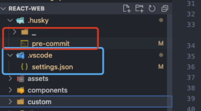

说明示例项目为看准的 kz-web-dev/react-web

# 如何改造项目

## eslint+prettier 格式化和规范代码

### 1.安装 npm 包

首先安装`eslint`+`prettier`+`eslint-webpack-plugin`

`cnpm install eslint  prettier eslint-webpack-plugin@2.x -D`

> 因为`eslint`和`prettier`一起使用可能会冲突所以还需要安装下方两个包，webpack4 请安
> 装eslint-webpack-plugin@2.x

安装`eslint-config-prettier`和`eslint-plugin-prettier`来配合使用

`cnpm install eslint-plugin-prettier  eslint-config-prettier -D`

> 请注意，有可能在 eslint 的`rules`里配置的会跟`prettier`有冲突，所以可以用 cli 工具检查一下，把相应
> 的规则更改或者删掉。[点这里](https://github.com/prettier/eslint-config-prettier#cli-helper-tool)

> 有一些 eslint-config-prettier 禁用的规则实际上可以在某些情况下启用。请参考这
> 里[special-rules](https://github.com/prettier/eslint-config-prettier#special-rules)

### 2.修改配置

在根目录添加文件

- `.eslintignore`

  - 用来忽略不需要格式化的文件，之后会用到这个文件夹

- `.eslintrc.js`

  - 用来写入`eslint`的具体`rules`和引入`extends`和`plugins`，具体请参考项目根目录下的该文件

- `.prettierrc.js`

  - 用来写入`prettier`的具体`rules`，具体请参考项目根目录下的该文件

更改 webpack 配置，添加`eslint-webpack-plugin`，具体参考`webpack.common.js`,如果项目之前用
着`eslint-loader`，需要删除不用，作者已经不在更新，推荐使用`eslint-webpack-plugin`

```javascript
const ESLintPlugin = require(\'eslint-webpack-plugin\')

plugins: [
    new ESLintPlugin({
        // 注意 这块需要context 到你的eslint 配置文件所在目录，因为webpack配置文件在scripts/ 所以需要../
        context: \'../\',
        emitError: true,
        emitWarning: true,
        failOnError: true,
        extensions: [\'ts\', \'tsx\', \'js\', \'jsx\'],
    }),
]
```

### 3.添加 airbnb 的配置

eslint 配置太多，一个个配置太过于麻烦，所以采用的业内最多人使用的`eslint-config-airbnb`配置，这个配
置包需要很多前置 npm 包，[点这里](https://www.npmjs.com/package/eslint-config-airbnb)去查看安转前置
包，使用方式就是在`.eslintrc.js`的`extends` 添加配置，具体请看`.eslintrc.js` 文件，已经是配置完成的
状态，因为里面会有很多配置比较严格或者不符合目前团队开发习惯的，可以在下方`rules`去覆盖相应配置

`cnpm install eslint-config-airbnb -D`

```javascript extends: ['airbnb', 'airbnb/hooks', 'plugin:prettier/recommended'],

```

### 4.vscode 添加插件

在 vscode 中下载`eslint`和`prettier`插件，然后在工作区添加`setting.josn`，添加配置,

建议在工作区添加配置，而不是在用户添加配置，这样可以在项目目录下生成一个`.vscode`文件，**下方图片蓝
色框框**里面的`setting.json`就是刚才添加的配置，并且把这个文件提交 git，保持整个团队风格统一，并且只
需要配置一次，也不会因为不同团队成员的不同 vscode 本地配置而导致格式化风格不统一



```json
{
  "editor.defaultFormatter": "esbenp.prettier-vscode",
  "[scss]": {
    "editor.defaultFormatter": "esbenp.prettier-vscode"
  },
  "[less]": {
    "editor.defaultFormatter": "esbenp.prettier-vscode"
  },
  "[css]": {
    "editor.defaultFormatter": "esbenp.prettier-vscode"
  },
  "[javascript]": {
    "editor.defaultFormatter": "esbenp.prettier-vscode"
  },
  "[markdown]": {
    "editor.defaultFormatter": "esbenp.prettier-vscode"
  },
  "editor.formatOnSave": true,
  "editor.formatOnPaste": true,
  "editor.formatOnType": true,
  "eslint.alwaysShowStatus": true,
  "prettier.printWidth": 120
}
```

## husky+lint-staged 来规范提交

### 1.安装 npm 包

首先安装`husky`+`lint-staged`

`cnpm install husky lint-staged@11.x -D`

> 注意 node 版本和`lint-staged`版本的关系，可以参
> 考[lint-staged](https://www.npmjs.com/package/lint-staged/v/11.2.6)里的 Changelog，本次 node 版本
> v12.16.3 安装的lint-staged@11.x

### 2.增加配置

首先需要初始化`husky`，来生成脚本，在`package.json`的`scripts`里添加命
令` "prepare": "husky install",`，来初始化生成脚本，并且添加"lint-staged"字段来配置。

```json
{
  "scripts": {
    "prepare": "cd .. && husky install react-web/.husky"
  },
  "lint-staged": {
    "*.{js,jsx,ts,tsx}": ["npm run checkFileIgnore", "eslint --color"]
  }
}
```

执行脚本 `npm run prepare`

然后添加钩子 `npx husky add .husky/pre-commit "npx lint-staged"`，

> 注意，如果你的项目类似于 kz-web-dev 这种的，一个 git 里多个项目，husky 需要更改一
> 下[参考这里](https://typicode.github.io/husky/#/?id=custom-directory)或者可以看该项目的相关配置，
> 就是这种情况

操作完成之后，会在你的`package.json`目录下生成一个`.husky`,里面会有一个`pre-commit`shell 脚本（上方图片红框），脚本
内容

```shell

#!/bin/sh
. "$(dirname "$0")/_/husky.sh"

cd react-web #这行是手动添加的
npx lint-staged -v --no-stash  # 这个命令可以自己去修改添加对应的参数 --no-stash 是执行多个lint-staged命令时，有错误不会滚到最初

```

此时 git 提交代码时，会走 lint-staged 相应的配置命令，实现代码检查等等之类的功能

### 3.老项目适配

如果是一个新项目，都是新文件，可以按照上述配置来修改，但是如果是老项目的话，可能很多文件都不是很符合
现在的代码要求，就会导致，eslint 校验一直过不去，导致开发的时候一直报错，git 提交提交代码页提交不上
去，所以进行以下修改

编写 node 脚本在项目根目录下执行，将目前所有的老文件 js 添加到`.eslintignore`到中

```js
const fs = require(\'fs\')
const path = require(\'path\')

const tarPath = path.join(__dirname, \'.eslintignore\')
// const eslintignore = fs.readFileSync(tarPath, \'utf-8\')

// const root = path.resolve(\'./assets\')
const root = \'./\'
// const root = path.resolve(\'./\')

// console.log(tarPath, root)
const list = []

const ignoreList = [
    \'assets\',
    \'dist\',
    \'node_modules\',
    \'style\',
    \'.editorconfig\',
    \'.eslintignore\',
    \'.gitignore\',
    \'nodeSc.js\',
    \'package-lock.json\',
    \'yarn.lock\',
]
const extnameList = [\'.js\', \'.jsx\']
const getFile = url => {
    let fileList = fs.readdirSync(url)
    fileList = fileList.filter(file => !ignoreList.includes(file))
    // console.log(fileList)
    fileList.forEach(file => {
        const fileDir = path.join(url, file)
        const stats = fs.statSync(fileDir)
        const isFile = stats.isFile&#40;&#41;
        const isDir = stats.isDirectory()
        if (isFile) {
            // console.log(fileDir)
            const extname = path.extname(fileDir)
            if (extnameList.includes(extname)) {
                list.push(fileDir)
            }
        }
        if (isDir) {
            getFile&#40;fileDir&#41;
        }
    })
}
getFile&#40;root&#41;

const result = ignoreList.concat(list).join(\'\
\')

fs.writeFileSync(tarPath, result, \'utf8\')
```

npm 下载`git-changed-files`可以检查当前 git 提交记录中修改过的文件，编写脚本`checkFileIgnore.js`在每
次 pre-commit 时，去检查有没有修改过老文件

`cnpm install git-changed-files -D`

```js
const fs = require(\'fs\')
const path = require(\'path\')

const gitChangedFiles = require(\'git-changed-files\')

const tarPath = path.join(__dirname, \'.eslintignore\')

const eslintignore = fs.readFileSync(tarPath, \'utf-8\')
// 返回结果
let result = \'\'
console.log(\'----读取.eslintignore成功----\')
const extnameList = [\'.js\', \'.jsx\', \'.ts\', \'.tsx\']
const getFile = async () => {
    const committedGitFiles = await gitChangedFiles({ showCommitted: false, showStatus: true })
    // console.log(committedGitFiles)
    const unCommittedFiles = committedGitFiles.unCommittedFiles || []
    const stagedFileList = unCommittedFiles.filter(fileObj => {
        return fileObj.status === \'Modified\'
    })
    // console.log(stagedFileList)
    stagedFileList.forEach(file => {
        const fileName = file.filename
        const extname = path.extname(fileName)
        if (extnameList.includes(extname)) {
            if (eslintignore.indexOf(fileName) !== -1) {
                // 判断.eslintignore文件中是否包含修改过的文件
                console.log(`----存在遗留文件的修改----`)
                const regex = new RegExp(`${fileName}`, \'gi\')
                if (!result) {
                    result = eslintignore.replace(regex, \'\')
                } else {
                    result = result.replace(regex, \'\')
                }
                console.log(`将${fileName}文件移出.eslintignore`)
            }
        }
    })
    // 最后只写入一次文件
    if (result) {
        fs.writeFileSync(tarPath, result, \'utf8\')
    }
}
getFile&#40;&#41;
```

更改`lint-staged`配置，每次提交前进行检查

```json
{
  "scripts": {
    "prepare": "cd .. && husky install react-web/.husky",
    "checkFileIgnore": "node ./checkFileIgnore.js",
    "eslint": "cross-env  npx eslint  --ext .js,.jsx  --fix $npm_config_file"
  },
  "lint-staged": {
    "*.{js,jsx,ts,tsx}": ["npm run checkFileIgnore", "eslint --color"]
  }
}
```

### 4.完成

一切顺利整体流程应该为，修改代码，然后`git暂存`，`git 提交`，这时候会进入`pre-commit` git 钩子，执行
配置好的`lint-staged`指令，如果暂存区修改的文件里包含`js,jsx,ts,tsx`，会执行脚本命
令`npm run checkFileIgnore`，去检查有没有老文件，如果没有，略过，执行下一个命令`eslint --color`，如
果有，会将老文件从`.eslintignore`中移出，此时执行下一步走`eslint检查`，此时老文件已经不
在`eslintignore`中，所以会检查老文件，检查大概率不通过，此时老文件的错误地方会在`vscode`中标红，会有
相应的提示辅助修改，将所有错误修改完毕之后，再次进行提交，走上述流程，检查通过，提交成功

如果没有修改老文件，新文件校验通过之后正常提交，校验失败拦截提交失败

> 在*lint-staged*配置中，`eslint`只是进行了检查，没有--fix 进行主动修复，如果想要可以手动自己添加，
> 建议不要，可以让开发者在手动更改错误的过程中明确项目配置常用的规则，提高代码开发质量

## 小程序适配

小程序 eslint 里关于 react 的规则都要删掉，并且全局变量添加小程序的变量，如`Page`，`Component`,`getApp` 等，替换`eslint-config-airbnb`为`eslint-config-airbnb-base`，关于`react`的包都不用下载

小程序配置`.prettierrc.js` 需要添加格式映射，并且`.eslintignore`里添加 \*.wxs 吧所有 wxs 忽略

```
module.exports = {
    overrides: [
        {
            files: \'**/*.wxml\',
            options: { parser: \'html\' },
        },
    ],
    ...其他格式化代码
}

```

vscode 也需要处理一下 setting.json

```json
{
  "editor.defaultFormatter": "esbenp.prettier-vscode",
  "[scss]": {
    "editor.defaultFormatter": "esbenp.prettier-vscode"
  },
  "[wxml]": {
    "editor.defaultFormatter": "esbenp.prettier-vscode"
  },
  "[wxss]": {
    "editor.defaultFormatter": "esbenp.prettier-vscode"
  },
  "[html]": {
    "editor.defaultFormatter": "esbenp.prettier-vscode"
  },
  "[javascript]": {
    "editor.defaultFormatter": "esbenp.prettier-vscode"
  },
  "editor.formatOnSave": true,
  "editor.formatOnPaste": true,
  "editor.formatOnType": true,
  "scssFormatter.printWidth": 120,
  "prettier.printWidth": 120,
  // 下面三行是插件wxml 的格式化也换成prettier
  "minapp-vscode.wxmlFormatter": "prettier",
  "minapp-vscode.disableAutoConfig": true,
  "minapp-vscode.reserveTags": ["text"],
  // 这个配合 prettierrc.js 一起使用 映射
  "prettier.documentSelectors": ["**/*.wxml"]
}
```

## 参考资料

[eslint](https://eslint.bootcss.com/docs/user-guide/configuring)

[prettier](https://prettier.io/docs/en/index.html)

[eslint-config-prettier](https://github.com/prettier/eslint-config-prettier)

[eslint-plugin-prettier](https://github.com/prettier/eslint-config-prettier)

[airbnb-config](https://github.com/airbnb/javascript)

[husky](https://typicode.github.io/husky/#/)

[lint-staged](https://www.npmjs.com/package/lint-staged/v/11.2.6)

[git-changed-files](https://www.npmjs.com/package/git-changed-files)

[eslint-webpack-plugin](https://github.com/webpack-contrib/eslint-webpack-plugin/tree/2.x)

如何使用
点这里
logo
