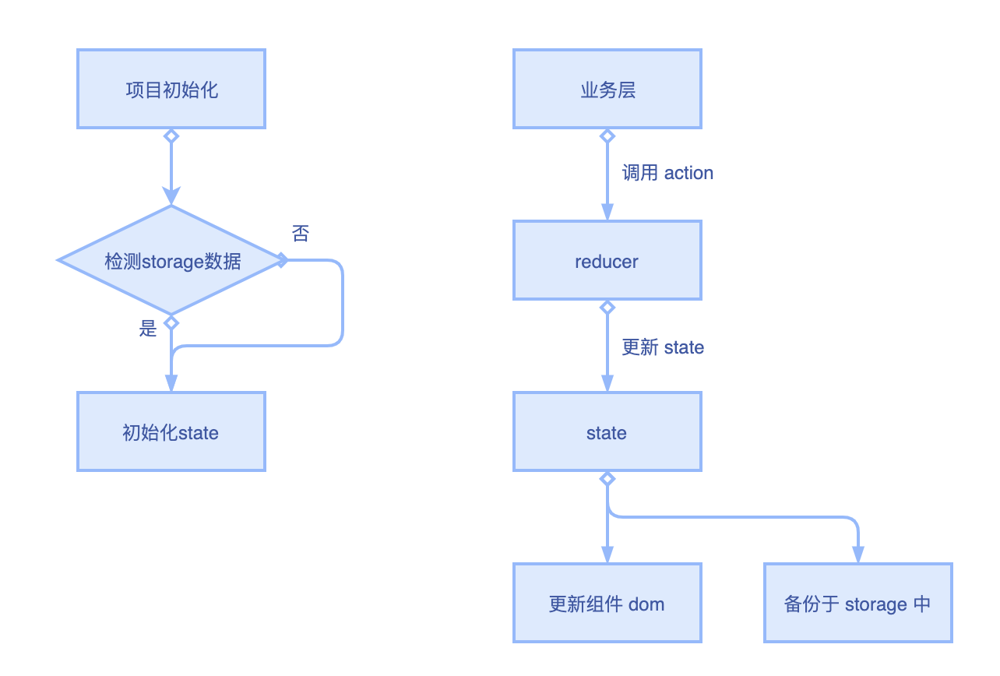

# 起因

小程序项目业务体量日渐庞大，越来越需要全局状态管理工具来实现数据管理及更新。 原先使用的`storage`及小程序的`globalData`都无法满足现有的业务需求，遂需要新的全局状态管理工具。
需求如下：

- 单项数据流，涉及数据的改动、操作，入口需要把控。
- 部分数据存于客户端，页面重载后数据依旧在。
- 数据更新后自动更新使用到该数据的组件 dom。
- 数据改动的方法书写便利，代码易读，较少歧义。

结合以上需求以及其他程序小程序的参考，决定使用`storage + redux + immer`的方式实现。

# 原理

1. 项目初始化时通过`storage`初始化`state`数据。
2. 在小程序页面/组件中，绑定`state`数据，根据`state`数据更新组件。
3. 在小程序页面/组件中，引入相应`action`，通过`action`操作改变`state`。
4. `immer`在此中可理解为`reducer`执行过程中的语法糖，符合书写习惯，增加代码健壮性。

流程图如下：


基于该方案，需要达成共识的规范：

- 彻底实施单项数据流，避免业务代码直接操作`storage`，`storage`仅与`redux`有数据交互，业务层也仅与`redux`有数据交互。
- 可以根据小程序分包结构来规划`reducers`的模块切分，但是绝不能将`reducer`文件置放于分包之中。
- 各个模块的`types`以 {模块名}/{方法名} 命名，避免不同模块之间`type`的命名发生冲突。

# 目录结构说明

```
 app.js
 app.json
 app.wxss
 common
 components
 pages
 libs
    redux
        immer.js
        minapp-redux.js
        redux-actions.min.js
        redux-logger.js
        redux-thunk.js
        redux.js
 utils
     redux
        reducer.js
        store.js
        reducers
           user.js
```

目录结构解释：

根目录下的`libs/`文件夹用于存放第三方库，引入之后无需改动。

`utils/`目录用于存放该开发人员编写的代码，所以将`store`入口及`reducers`放于`utils/redux`中。

# 开发说明

若在业务场景中需要将数据存于`redux`，假设该模块为`user`：

1.  在`/utils/redux/reducers/`目录下添加`user.js`，并设置好`types`，`Actions`，`initialState`，`reducer`。

```
    import Immer from \'../../../libs/redux/immer\';
    import store from \'../store\'
    import { createAction } from "../../../libs/redux/redux-actions.min";

    // 设置types名
    export const types = {
        setUserStateType: \'user/setUserState\' // 更细用户状态状态
    }

    // 设置actions
    export const Actions = {
         setUserState: createAction(types.setUserStateType, opts => opts)
    }

    // 初始化数据
    const initialState = {
        userState: wx.getStorageSync(\'userState\') ? JSON.parse(wx.getStorageSync(\'userState\')) : {}
    };

    export default function reducer(state = initialState, { type, payload, error }) {
        return Immer(state, draft => {
            switch (type) {
                case types.setUserStateType:
                    if (payload) {
                        draft.userState = payload;
                        wx.setStorageSync(\'userState\', JSON.stringify(payload));
                    }
                    break;
                default:
                    break;
            }
        })
    }
```

2.  在`/utils/redux/reducer.js`引入`user.js`，并纳入当前`redux`体系中。

```javascript import { combineReducers } from '../../libs/redux/redux';
  import user from \'./reducers/user\';

  //合并多个reducer
  export default combineReducers({
      user
  });
```

3.  在业务代码中使用该模块。

- 在页面、组件中使用：

```
  import { Actions } from \'/utils/redux/reducers/user\'
  import { connect } from \'/libs/redux/minapp-redux\'

  // 安插 userState 于组件data中
  const stateMap = state => {
      const { userState } = state.user;
      return { userState }
  };

  // 安插方法于组件中
  const methodMap = (dispatch, state) => ({
      setUserState(data) {
          dispatch(Actions.setUserState(data));
      }
  })

  Page(
      connect(stateMap, methodMap)({
          data: {},
          onLoad () {
              this.setUserState({a: 1});
              console.log(this.data.userState);
          }
      })
  )
```

- 直接在 js 文件中使用：

```
import store from \'/utils/redux/store\';
import { Actions } from \'/utils/redux/reducers/user\'

store.dispatch(Actions.setUserState({
      a: 1
}))
```

# 参考文档

[miniapp-redux](https://www.npmjs.com/package/minapp-redux)

[redux](https://www.redux.org.cn/)
