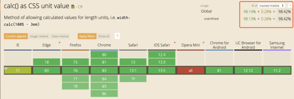
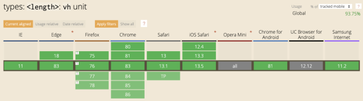

## 底部按钮固定


**不使用定位方案**

使用 css3 **calc** 计算函数配合 **vh**单位实现。 在移动端兼容良好, 并且 h5 页面基本都是嵌套在微信、公司的 app。完全可用。

### calc css3 计算函数 height




```html
<div class="page">
    <div class="content">
        <p>滚动区域</p>
        <p>滚动区域</p>
        <p>滚动区域</p>
        <p>滚动区域</p>
        <p>滚动区域</p>
        <p>滚动区域</p>
        <p>滚动区域</p>
        <p>滚动区域</p>
        <p>滚动区域</p>
        <p>滚动区域</p>
        <p>滚动区域</p>
        <p>滚动区域</p>
        <p>滚动区域</p>
        <p>滚动区域</p>
        <p>滚动区域</p>
        <p>滚动区域</p>
        <p>滚动区域</p>
        <p>滚动区域</p>
        <p>滚动区域</p>
        <p>滚动区域</p>
        <p>滚动区域</p>
        <p>滚动区域</p>
        <p>滚动区域</p>
        <p>滚动区域</p>
        <p>滚动区域</p>
        <p>滚动区域</p>
        <p>滚动区域</p>
        <p>滚动区域</p>
        <p>滚动区域</p>
        <p>滚动区域</p>
        <p>滚动区域</p>
        <p>滚动区域</p>
        <p>滚动区域</p>
        <p>滚动区域</p>
    </div>

    <div class="btns">底部按钮</div>
</div>
```

```css
.btns {
    line-height: 50px;
    background-color: #ccc;
    display: flex;
    align-items: center;
    justify-content: center;
}

.content {
    overflow-y: auto;
    -webkit-overflow-scrolling: touch;
    height: calc(100vh - 50px);
}
```

## 弹窗表单


### 会出现的几种问题

-   IOS 键盘弹出后，会把固定定位表现为绝对定位，会出现很多意外情况。在开发中尽量使用绝对定位来替代固定定位。
-   手在屏幕上滚动时会发生事件穿透。需要使用 js 阻止事件穿透带来的影响。
-   在 IOS 屏幕被挤上去后，键盘消失时会发生页面无法下来导致出现键盘大小的空白。需要在失去焦点时让出现滚动的元素向上或者向下滚动 1 像素即可。或者当键盘弹起时给 body 添加 ` overfilow: hidden;` ,键盘消失后移除。

```html
<div class="modal">
    <div class="mask"></div>
    <div class="content">
        <input type="text" onblur="scrollTop" />
    </div>
</div>
```

```css
.modal {
    position: absolute;
    top: 0;
    left: 0;
    right: 0;
    height: 100vh;
    display: flex;
    flex-direction: column-reverse;
}
.modal .mask {
    position: absolute;
    left: 0;
    right: 0;
    bottom: 0;
    top: 0;
}
.modal .content {
    height: 50px;
}
```

```js
function closest(el, selector) {  // 定位父级元素
  const matchesSelector = el.matches || el.webkitMatchesSelector || el.mozMatchesSelector || el.msMatchesSelector;
  while (el) {
    if (matchesSelector.call(el, selector)) {
      return el;
    }
    el = el.parentElement;
  }
  return null;
}

onWrapTouchStart = (e) => {  // 处理弹窗的事件穿透问题
  if (!/iPhone|iPod|iPad/i.test(navigator.userAgent)) {
    return;
  }
  const pNode = closest(e.target, \'.content\');  // 根据需要处理 .content 下面所有元素的穿透
  if (!pNode) {
    e.preventDefault();
    }
 }

scrollTop = () => {  // 一屏页面只需要滚动到顶部就可以让ios出现的白条消失
   document.documentElement.scrollTop = 0;
}
```
